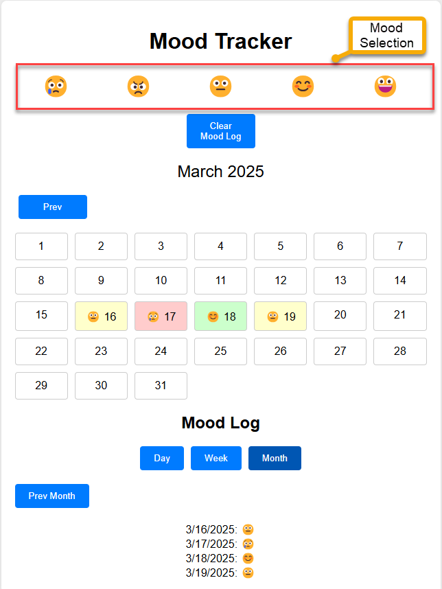
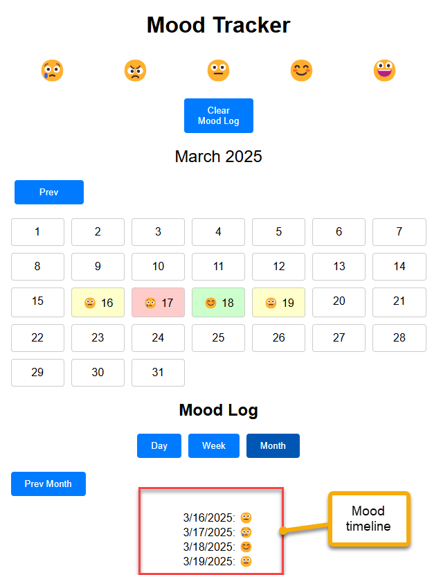
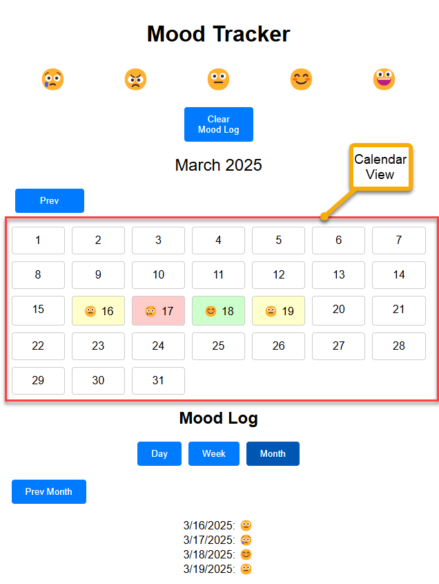
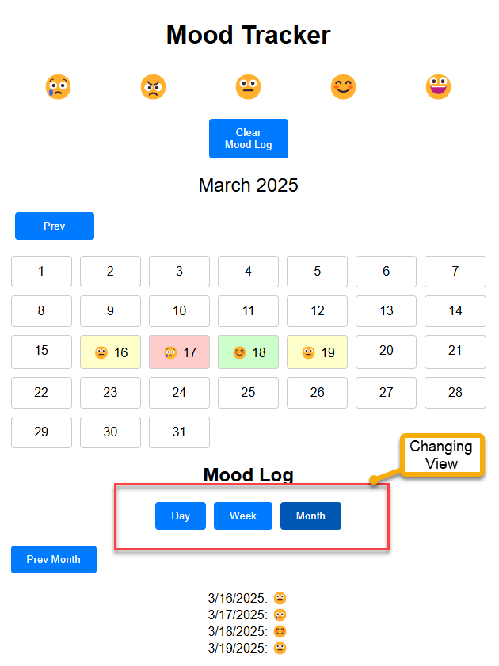

# Mood Tracker

## Application Features

- **Mood Selection**: Users can select their mood from five different options: sad, angry, neutral, happy, and excited.
- **Mood Logging**: The selected mood is logged and stored in the local storage with the current date.
- **Mood Timeline**: Displays the logged moods in a timeline format based on the selected view (day, week, month).
- **Calendar View**: Shows a calendar with the logged moods for each day of the current month.
- **Navigation**: Users can navigate through different days, weeks, and months to view their mood logs.
- **Clear Mood Log**: Users can clear all the logged moods from the local storage.
- **Responsive Design**: The application is designed to be responsive and works well on different screen sizes.

## Screenshots

### Mood Selection

### Mood Timeline

### Calendar View

### Changing View (Day, Week, Month)

